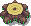
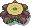
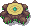
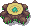
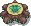
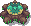
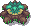
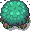
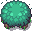
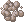

# **Présentation Partie Agent**

## Animation

Les proies et les prédateurs peuvent se déplacer dans 4 directions.

L'animation dans chaque direction est composée de 3 images

## Manger

Un prédateur rencontre une proie et la mange. La proie mangera aussi l'herbe mature quand elle la rencontrera.

## Rencontrer un obstacle

L'agent se dirige de manière aléatoire lorsqu'il rencontre un obstacle.

## La chasse et la fuite 

Les prédateurs vont trouver la proie la plus proche dans un certain rayon d'action. Les proies peuvent également trouver le prédateur le plus proche dans un certain rayon d'action.

## Pause

L'agent s'arrête pour se reposer après une période de mouvement. Lorsqu'il a faim après n'avoir pas mangé pendant un certain temps, il recommence à se dépenser.

## Reproduction

L'agent a une chance de se reproduire en se déplaçant.

# **Présentation Partie Environnement**

## **Descritpif du Monde**

Le monde est composé :
- d'éléments adaptatifs (montagnes, lacs, rochers, troncs d'arbre)
- de la végétation (arbres, herbes)
- d'une météo(saison, vent, températures...)
- d'agents (proies/prédateurs)

### **Elements adaptatifs**

#### **Montagnes et Points d'eau**

Les montagnes et les points d'eau sont placées selon une carte d'altitude (max altitude : 500m) qui déterminera leurs emplacements (exemple : les points ayant une altitude supérieur à 495m signifie qu'il y a un sommet, donc une montagne ; les points ayant une altitude inférieur à 5m sont des creux, donc un lac).

>De plus, leurs apparences dépendent de la saison :

                        

                        

### **Rochers et Troncs d'arbre**

Les rochers et troncs sont répartis aléatoirement sur la map. Leur seul fonction est de jouer le rôle d'obstacle pour les agents.

>Leurs apparences changent aussi :

                 

                    

### **Végétation**

#### **Arbres et Herbes**

Les plantes sont répartis aléatoirement sur la map. Ils évoluent en passant par différentes formes et ce jusqu'à atteindre leur maturité :

>Le temps d'évolution d'une plante dépend de la distance de l'eau à laquelle il se trouve ainsi que de la saison:

    
    
    
 

  

  

Ici on peut apercevoir que l'arbe se trouvant à proximité d'un point d'eau pousse beaucoup plus vite:

Une plante peut prendre feu à n'importe quel moment, cela dépend de la température et de la saison (pas de feu en Hiver), et le feu se propage selon la direction dans laquelle souffle le vent.

Voici les étapes du feu :

       

Arbre en feu : 

Propagation du feu avec un vent qui souffle au Nord-Est:

## **Météo**

Le système cyclique comporte 4 saisons : Eté, Automne, Hiver et Printemps. A chaque saison est réatribué une température moyenne, le sens du vent (nuages), sa vitesse ainsi que la probabilité de mise à feu et de repousse pour la végétation.

   

Il y a deux forme de nuage :

 