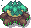

# **Présentation Partie Environnement**

## **Descritpif du Monde**

Le monde est composé :
- d'éléments adaptatifs (montagnes, lacs, rochers, troncs d'arbre)
- de la végétation (arbres, herbes)
- d'un système cyclique de saison (vent,températures...)
- d'agents (proies/prédateurs)

### **Elements adaptatifs**

#### **Montagnes et Points d'eau**

Les montagnes et les points d'eau sont placées selon une carte d'altitude (max altitude : 500m) qui déterminera leurs emplacements (exemple : les points ayant une altitude supérieur à 495m signifie qu'il y a un sommet, donc une montagne ; les points ayant une altitude inférieur à 5m sont des creux, donc un lac).

>De plus, leurs apparences dépendent de la saison :

                  

                  

### **Rochers et Troncs d'arbre**

Les rochers et troncs sont répartis aléatoirement sur la map. Leur seul fonction est de jouer le rôle d'obstacle pour les agents.

>Leurs apparences changent aussi :

            

### **Végétation**

## **Arbres et Herbes**

Les plantes sont répartis aléatoirement sur la map. Ils évoluent en passant par différentes formes et ce jusqu'à atteindre leur maturité :

>Le temps d'évolution d'un arbre dépend de la distance de l'eau à laquelle il se trouve :

    
    
    
 

Un arbre peut prendre feu à n'importe quel moment, cela dépend de la température et le feu se propage selon la direction dans laquelle souffle le vent :

>Arbre en feu
